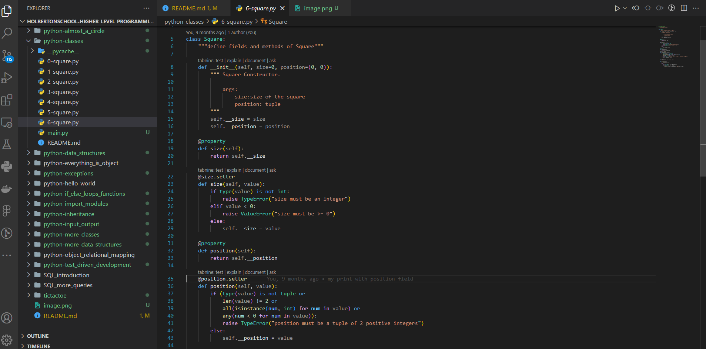

# Higher-level programming - Python - JavaScript - SQL

## About the Developer

Hi there! I'm Ramzi Hkiri, a passionate developer with a love for creating meaningful projects. Feel free to connect with me on [LinkedIn](https://github.com/RamziHkiri), [WhatsApp](+216 54 247 108).

## Project Description

Holberton School conducted a module on high-level programming and Python as part of their Full Stack Software Engineering studies.

### Key Features

- python: learn Python programming languages from scratch by doing basic project and tasks.
- JavaScript: learn Javascript programming languages from scratch by doing basic project and tasks.
- SQL: learn SQL programming languages from scratch by doing basic project and tasks.

### To-Do List

- python_hello_world: It aims to learn about variables, basics commands (print) and handle strings with Python
- python_more_classes: It aims to learn about object oriented programming (OOP), Data Abstraction, Data Encapsulation, instances and classes attributes in Python.
- python-test_driven_development: It aims to learn about docstrings to create and implement tests in Python
- SQL_introduction: It aims to learn about databases, relational databases, subqueries, tables, MySQL statements and functions.
- SQL_more_queries: It aims to learn about how to create a new user, manage privileges for a user, PRIMARY KEY, FOREIGN KEY, constraints, subqueries, JOIN and UNION with MySQL.
- JavaScript_dom_manipulation: It aims to learn about JavaScript dom manipulations.
...

## Development Story

The previous projects were done during long periode, after a very hard difficulty to find the right solution for each task. There were many projects and I was limited by a deadline. But I think it was very important experience. 

## Future Features

- In the future I will try  to build a full project using those languages to practice what I mentioned before.

## Screenshots

